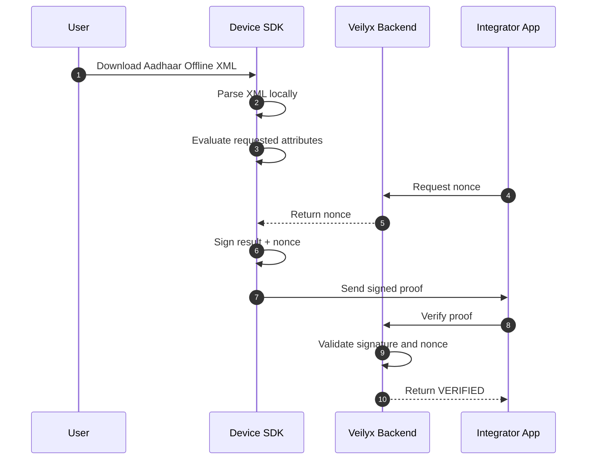

# Veilyx
### Verification infrastructure for India
**Proofs, not documents**

A privacy-preserving verification layer for Indian applications.


---

# Problem

Most applications must verify user attributes such as:

- Age
- State of residence
- Identity validity

Traditional KYC requires collecting identity documents such as Aadhaar or PAN.

This introduces:

- Large databases of sensitive documents
- Breach liability
- DPDP compliance overhead
- Onboarding friction

---

# How It Works

Verification happens **entirely on the user's device**.

Applications receive only:

- Verification result
- Device identifier
- Cryptographic signature

Example payload received by an application server:

```json
{
  "attributes_verified": {
    "age_above_18": true
  }
}
```

No identity documents are transmitted or stored.

---

# Architecture Flow

Sensitive identity data never leaves the user device.



The backend verifies **cryptographic signatures**, not identity documents.

---

# Integration Overview

1. Register company and obtain API key
2. Install SDK
3. Fetch nonce from GET /nonce
4. Request verification proof
5. Validate proof via POST /verify

```typescript
const { nonce } = await fetch(`${BACKEND_URL}/nonce`, {
    headers: { 'X-API-Key': API_KEY }
}).then(r => r.json());

const proof = await Veilyx.requestProof({
    companyName: 'YourCompany',
    checks: ['age_above_18'],
    nonce: nonce,
    aadhaarXml: aadhaarXml
});

await fetch(`${BACKEND_URL}/verify`, {
    method: 'POST',
    headers: { 'X-API-Key': API_KEY, 'Content-Type': 'application/json' },
    body: JSON.stringify(proof)
});
```

### Android

```kotlin
val nonce = fetchNonce()

val proof = veilyx.requestProof(
    companyName = "YourCompany",
    checks = listOf("age_above_18"),
    nonce = nonce,
    aadhaarXml = xmlString
)
```

### iOS

```swift
let nonce = await fetchNonce()

let proof = try await veilyx.requestProof(
    companyName: "YourCompany",
    checks: ["age_above_18"],
    nonce: nonce,
    aadhaarXml: xmlString
)
```

---

# Portable Verification Credentials (PVCs)

After a successful verification, the Veilyx backend issues a signed credential that can be reused across services without repeating full verification.

PVCs are signed by the Veilyx backend rather than the device, allowing validation by multiple services using the Veilyx public key.

> The `device_id` is included for audit and abuse detection but does not prevent credential reuse across services.

Operational flow:

1. User verifies attribute using the Veilyx SDK
2. Backend validates proof
3. Backend issues a signed credential
4. User presents credential to other services
5. Services verify the credential signature using the Veilyx public key

```json
{
  "credential_type": "identity_verification",
  "attributes_verified": {
    "age_above_18": true
  },
  "issuer": "veilyx",
  "device_id": "uuid",
  "timestamp": "2026-03-06T12:00:00Z",
  "signature": "base64-signature"
}
```

---

# Security Architecture

| Control | Implementation | Status |
|---------|---------------|--------|
| Hardware-backed keys | AndroidKeyStore / iOS Secure Enclave | Active |
| Proof signatures | RSA-2048 / ECDSA verification | Active |
| Replay protection | Mandatory single-use nonce | Active |
| Timestamp freshness | 300 second proof expiry | Active |
| Cross-company injection | requested_by validated against API key | Active |
| SSRF protection | Internal IP/hostname blocklist on webhooks | Active |
| XXE protection | Explicit OWASP flags on XmlPullParser | Active |
| Portable credentials | RSA system-level signing | Active |
| Rate limiting | slowapi middleware | Active |
| Webhook authentication | HMAC-SHA256 signatures | Active |
| Zero document storage | Proof-only verification model | Active |
| Hardcoded credentials removed | All secrets via environment variables | Active |
| OAuth URL encoding | DigiLocker code/state percent-encoded | Active |
| Deep link hijacking (veilyx://) | Universal Links migration | Planned |
| UIDAI XML signature verification | UIDAI digital signature validation | Planned |
| Play Integrity server-side validation | Real token verification | Planned |
| Apple App Attest | Real device attestation | Planned |
| Certificate pinning | SDK network calls | Planned |

Security audit history and pending items: [SECURITY.md](SECURITY.md)

---

# Deployment

Veilyx backend is deployed on [Railway](https://railway.app).

### Environment Variables

Set the following in your Railway project dashboard:

| Variable | Required | Description |
|----------|----------|-------------|
| `DIGILOCKER_CLIENT_ID` | No* | DigiLocker partner client ID |
| `DIGILOCKER_CLIENT_SECRET` | No* | DigiLocker partner client secret |
| `DIGILOCKER_REDIRECT_URI` | No* | OAuth callback URL, e.g. `https://web-production-fe8772.up.railway.app/digilocker/callback` |

*If unset, all `/digilocker/*` endpoints will be non-functional. All other endpoints work normally.

Railway auto-deploys on every push to `main`. The `railway.toml` and `Procfile` in the project root handle build and start configuration automatically.

---

# API Endpoints

| Method | Endpoint | Auth | Description |
|--------|----------|------|-------------|
| GET | / | None | Health check |
| POST | /company/register | None | Register company, receive API key |
| POST | /device/register | None | Register device public key |
| GET | /nonce | API Key | Get single-use nonce for replay protection |
| POST | /verify | API Key | Verify a signed proof |
| POST | /credential/issue | API Key | Issue a portable verification credential |
| GET | /stats | API Key | Verification analytics and billing |
| GET | /logs | API Key | Last 50 verification logs |
| GET | /devices | API Key | All registered devices for this company |
| GET | /dashboard | API Key (X-API-Key header) | Live verification dashboard |
| POST | /webhooks/register | API Key | Register a webhook endpoint |
| GET | /webhooks | API Key | List registered webhooks |
| DELETE | /nonce/cleanup | API Key | Delete expired nonces |
| GET | /digilocker/auth | None | Initiate DigiLocker OAuth flow |
| GET | /digilocker/callback | None | DigiLocker OAuth callback |
| GET | /digilocker/status | None | Check DigiLocker configuration |
| DELETE | /digilocker/cleanup | API Key | Clean up used OAuth states |
| GET | /docs | None | Swagger UI |

Authentication header:

```
X-API-Key: your_api_key_here
```

---

# SDK Methods

| Method | Platform | Description |
|--------|----------|-------------|
| initialize() | Android, iOS | Generates hardware-backed key pair, returns deviceId and publicKeyPem |
| requestProof(companyName, checks, nonce, aadhaarXml) | Android, iOS | Parses Aadhaar XML locally, returns signed proof |
| pickAadhaarFile() | Android, iOS | Opens native file picker, returns file URI |
| readAadhaarFile(fileUri) | Android, iOS | Reads Aadhaar XML content from file URI |
| handleDigiLockerCallback(code, state) | Android, iOS | Exchanges DigiLocker OAuth code for Aadhaar XML |
| handleDeepLink(url) | Android, iOS | Parses deep link URL, returns code and state |

---

# Rate Limiting

| Endpoint | Limit |
|----------|-------|
| /verify | 20 requests/minute |
| /device/register | 5 requests/minute |
| /company/register | 3 requests/minute |
| /nonce | 30 requests/minute |
| /credential/issue | 5 requests/minute |
| /stats, /logs, /devices, /dashboard, /webhooks | 10 requests/minute |

---

# Tech Stack

| Layer | Technology |
|-------|------------|
| Backend API | Python 3.10+ / FastAPI / slowapi |
| Database | SQLite (dev) / PostgreSQL (production) |
| Cryptography | Python cryptography library — RSA-2048 + P256 ECDSA |
| Android SDK | Kotlin / AndroidKeyStore / XmlPullParser / Play Integrity API |
| iOS SDK | Swift / CryptoKit / Secure Enclave / iOS Keychain |
| React Native bridge | Objective-C / veilyx-react-native |
| Demo app | React Native / App.tsx |
| Deployment | Railway / Nixpacks |

---

# Project Structure

```
veilyx/
├── api.py
├── test_sdk_simulation.py
├── requirements.txt
├── Procfile
├── railway.toml
├── SECURITY.md
├── veilyx-react-native/
│   ├── src/index.ts
│   ├── android/.../VeilyxModule.kt
│   ├── android/.../VeilyxConfig.kt
│   ├── ios/Veilyx.swift
│   └── ios/Veilyx.m
└── veilyx-gaming-demo/
    └── App.tsx
```

---

# Local Development

Install dependencies:

```bash
pip install -r requirements.txt
```

Start the server:

```bash
python -m uvicorn api:app --reload
```

Run the test suite:

```bash
python test_sdk_simulation.py
```

API docs:

```
http://127.0.0.1:8000/docs
```

---

# Test Results

```
=== VEILYX SDK SIMULATION STARTED ===
[SDK] Keypair generated for Device: <uuid>
[API] Registered TestCorp_764e96 (API Key: HOmOnK1x...)
[API] Device registered
--- TEST: Standard Verification Flow ---
[API] Fetched nonce: ZKLYEf1cyiJuiiaiOT...
[API] Verification Result: True
--- TEST: Replay Attack (Same Nonce) ---
[API] Blocked Replay? True (Status: 400)
--- TEST: Portable Verification Credential (PVC) ---
[API] PVC Issued Successfully
```

---

# Roadmap

### Infrastructure
- [x] Deploy backend to Railway
- [x] Replace all hardcoded localhost URLs with environment variables
- [x] Railway deployment config (Procfile + railway.toml)
- [ ] Migrate api.py from SQLite to PostgreSQL via psycopg2
- [ ] Connect to Railway Postgres via DATABASE_URL environment variable

### Integrations
- [ ] Apply for DigiLocker partner account at partners.digitallocker.gov.in
- [x] Move DIGILOCKER_CLIENT_ID and DIGILOCKER_CLIENT_SECRET to environment variables
- [x] Set DIGILOCKER_REDIRECT_URI as Railway environment variable
- [ ] Test full DigiLocker OAuth flow end to end

### Security Hardening
- [x] Fix webhook HMAC signature (hmac.HMAC)
- [x] Fix Android file URI vs XML content bug
- [x] Fix iOS backend URL localhost fallback
- [x] Fix OAuth URL encoding for DigiLocker callback
- [x] Fix Kotlin date parse break logic
- [ ] Replace veilyx:// custom scheme with Universal Links and Android App Links
- [ ] Configure Apple App Site Association file
- [ ] Configure Android App Links in AndroidManifest.xml
- [ ] Implement UIDAI XML signature verification on Android and iOS
- [ ] Implement Play Integrity token validation server-side
- [ ] Implement Apple App Attest token validation server-side
- [ ] Replace iOS regex XML parsing with XMLParser
- [ ] Certificate pinning in SDK network calls
- [ ] Penetration testing

---

# Pricing

₹4 per successful verification.

Multiple attributes verified in a single proof count as **one verification**.

Failed proofs are **not billed**.

---

# License

MIT License.

