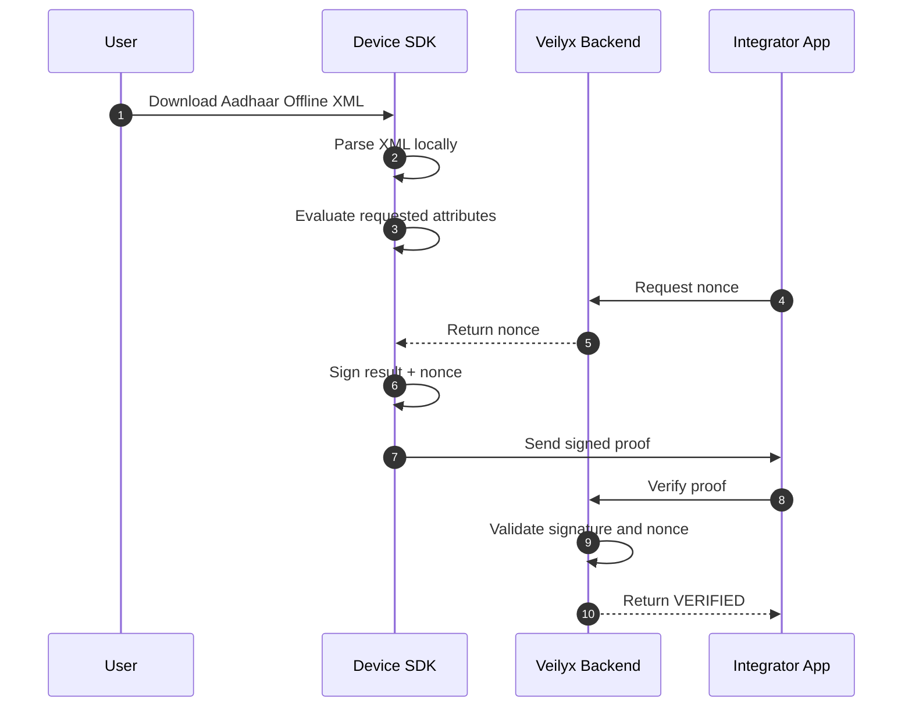

# Veilyx
### Verification infrastructure for India  
**Proofs, not documents**

₹4 per successful verification. Zero document storage. Designed to reduce DPDP data exposure.


---

## Veilyx vs Traditional KYC

| Feature | IDfy / HyperVerge | Veilyx |
|--------|-------------------|--------|
| Data stored | Full identity documents | None |
| Verification time | 3–30 seconds | Sub-second |
| Cost | ₹15–₹25 | ₹4 |
| Compliance exposure | Document storage obligations | No document storage |

Compliance exposure explanation:

Veilyx stores **no identity documents**.  
Only the following metadata is retained:

- device identifiers  
- verification timestamps  
- verification result flags  

This reduces DPDP obligations related to storing sensitive identity documents.

---

# Problem

Most applications must verify user attributes such as:

- Age  
- State of residence  
- Identity validity  

Traditional KYC requires collecting identity documents such as Aadhaar or PAN.

This introduces several risks:

- onboarding friction  
- large databases of sensitive documents  
- breach liability  
- DPDP compliance overhead  

---

# Veilyx Approach

Veilyx replaces document uploads with **cryptographic proofs**.

Verification happens **entirely on the user's device**.

Applications receive only:

- verification result  
- device identifier  
- cryptographic signature  

Example payload received by an application server:

```json
{
  "attributes_verified": {
    "age_above_18": true
  }
}
```

No identity documents are transmitted or stored.

---

# Integration Overview

Typical integration time: **less than one day**

1. Register company and obtain API key  
2. Install SDK  
3. Request verification proof  
4. Validate proof via Veilyx API  

### Example

```javascript
const { nonce } = await fetch("https://api.veilyx.io/nonce").then(r => r.json());

const proof = await Veilyx.requestProof({
  checks: ["age_above_18"],
  nonce: nonce
});

await fetch("https://api.veilyx.io/verify", {
  method: "POST",
  headers: {
    "X-API-Key": process.env.VEILYX_API_KEY
  },
  body: JSON.stringify(proof)
});
```

---

# Architecture Flow

Sensitive identity data never leaves the user device.



The backend verifies **cryptographic signatures**, not identity documents.

---

# Portable Verification Credentials (PVCs)

Veilyx supports **portable verification credentials** for reusable identity proofs.

This allows a verification result to be reused across multiple services without repeating full verification.

Operational flow:

1. User verifies attribute once using the Veilyx SDK
2. A signed credential is generated by the Veilyx backend
3. The user presents this credential to other services/apps
4. Services verify the credential cryptographically using the Veilyx system public key

Example credential format:

```json
{
  "credential_type": "age_verification",
  "attributes_verified": {
    "age_above_18": true
  },
  "issuer": "veilyx",
  "device_id": "uuid",
  "timestamp": "2026-03-06T12:00:00Z",
  "signature": "base64-signature"
}
```

---

# Security Architecture

## Implemented Controls

| Control | Implementation | Status |
|-------|---------------|--------|
| Hardware-backed keys | AndroidKeyStore / iOS Secure Enclave | Active |
| Proof signatures | RSA-2048 / ECDSA verification | Active |
| Replay protection | Mandatory single-use nonce | Active |
| Portable Credentials | RSA system-level signing | Active |
| Rate limiting | slowapi middleware | Active |
| Webhook authentication | HMAC-SHA256 signatures | Active |
| Zero document storage | Proof-only verification model | Active |
| UIDAI XML authenticity | UIDAI digital signature verification | In Progress |

---

## DigiLocker Integration

When DigiLocker is used:

1. XML is fetched via OAuth
2. UIDAI signature verification is performed
3. XML is parsed to extract required attributes
4. XML is deleted immediately after parsing

Only verification results and metadata are retained.

Audit logs store:

- verification timestamp
- verification result
- device identifier

Document contents are **never logged or stored**.

---

# Operational Resilience

| Scenario | Mitigation |
|--------|-----------|
| DigiLocker API unavailable | fallback to manual XML upload |
| Nonce rate limits reached | client retry with exponential backoff |
| Database failure | encrypted daily backups |
| Signature verification failure | proof rejected without billing |

---

# Use Cases

## Dating Applications

Verify users are over 18 without requiring ID uploads.

Benefits:

- verified profiles  
- reduced fake accounts  
- privacy preservation  

---

## Real Money Gaming

Gaming platforms must verify:

- players are over 18  
- players are not from restricted states  

Example proof:

```json
{
  "age_above_18": true,
  "state_allowed": true
}
```

---

## Marketplaces

Enable verified seller badges without storing identity documents.

---

## Fintech Platforms

Reduce onboarding friction for wallet activation and identity verification flows.

---

## Gig Platforms

Verify delivery partners instantly during onboarding.

---

# Technology Stack

| Layer | Technology |
|------|------------|
| Backend API | Python 3.10+, FastAPI |
| Database | PostgreSQL (production), SQLite (development) |
| Cryptography | Python cryptography library |
| Android SDK | Kotlin, AndroidKeyStore |
| iOS SDK | Swift, CryptoKit, Secure Enclave |
| React Native | TypeScript bridge |

---

# API Endpoints

| Method | Endpoint | Description |
|------|---------|-------------|
| POST | `/company/register` | Register company |
| POST | `/device/register` | Register device public key |
| GET | `/nonce` | Generate replay-protection nonce |
| POST | `/verify` | Verify signed proof |
| POST | `/credential/issue` | Issue portable signed credential |
| POST | `/webhooks/register` | Register webhook |
| GET | `/stats` | Verification analytics |
| GET | `/logs` | Verification logs |
| GET | `/docs` | Swagger documentation |

Authentication header:

```
X-API-Key: your_api_key_here
```

---

# Pricing

₹4 per **successful proof verification**.

Multiple attributes verified in a single proof count as **one verification**.

Failed proofs (tampered signatures, invalid payloads) are **not billed**.

---

# SDK Example

### Android

```kotlin
val veilyx = Veilyx.initialize(apiKey = "your_key")

val nonce = fetchNonce()

val proof = veilyx.requestProof(
    checks = listOf("age_above_18"),
    aadhaarXml = xmlString,
    nonce = nonce
)
```

### iOS

```swift
let veilyx = try await Veilyx.initialize(apiKey: "your_key")

let nonce = await fetchNonce()

let proof = try await veilyx.requestProof(
    checks: ["age_above_18"],
    aadhaarXml: xmlString,
    nonce: nonce
)
```

### React Native

```typescript
const { deviceId } = await Veilyx.initialize("your_key");

const { nonce } = await fetch("https://api.veilyx.io/nonce").then(r => r.json());

const proof = await Veilyx.requestProof({
  checks: ["age_above_18"],
  aadhaarXml: xmlString,
  nonce
});
```

---

# Local Development

### Prerequisites

- Python 3.10+
- PostgreSQL
- Node.js 18+
- Android Studio or Xcode

### Setup

```bash
git clone https://github.com/shashwatkhandelwal-debug/veilyx.git
cd veilyx

pip install -r requirements.txt

cp .env.example .env
```

Run API:

```bash
python -m uvicorn api:app --reload
```

Run SDK simulation:

```bash
python test_sdk_simulation.py
```

API docs:

```
http://127.0.0.1:8000/docs
```

---

# Production Hardening Roadmap

- Replace localhost endpoints  
- Configure PostgreSQL and Redis  
- Apply for DigiLocker partner integration  
- Implement Play Integrity verification  
- Implement Apple App Attest validation  
- Configure Universal Links and Android App Links  
- Enable certificate pinning  
- Complete penetration testing  
- Prepare SOC2 compliance roadmap  

---

# License

MIT License.

Core verification engine is open source. Hosted infrastructure and dashboard services may be commercially licensed.
