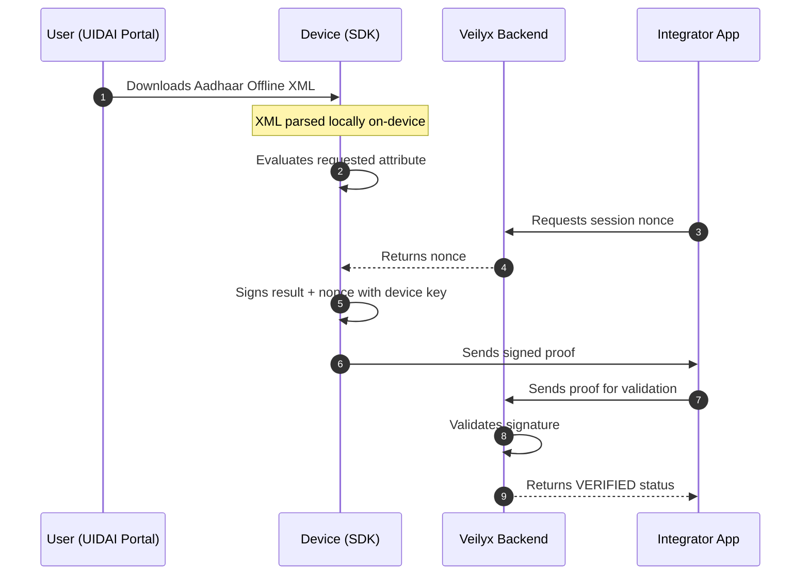

# Veilyx
### Verification infrastructure for India  
**Proofs, not documents.**

Veilyx allows apps to verify user attributes (such as age or residency) **without collecting identity documents**.

Instead of uploading IDs, the user’s device generates a **cryptographically signed proof** confirming the requested attribute. The application receives only the verification result — never the document itself.


---

# Overview

Many applications must verify user attributes such as:

- age
- state of residence
- identity validity

Today this typically requires collecting sensitive identity documents like Aadhaar, PAN, or passports.

This creates major problems:

- privacy risks and user drop-off
- large databases of sensitive documents
- data breach liability
- regulatory overhead (DPDP Act compliance)

**Veilyx replaces document sharing with cryptographic proofs.**

The verification happens **locally on the user's device**. Only a signed proof is transmitted to the backend.

Example payload received by your server:

```json
{
  "attributes_verified": {
    "age_above_18": true
  }
}
```

No identity document is transmitted, stored, or exposed.

---

# Why Proofs Instead of Documents

Traditional identity verification requires uploading documents.

This creates centralized databases containing millions of identity records.

If those systems are breached, attackers gain access to:

- government IDs
- addresses
- personal identity details

Veilyx removes this risk entirely.

Instead of storing documents:

```
documents stay on the user device
apps receive only verification results
```

This dramatically reduces privacy and compliance risks.

---

# Quick Example

```javascript
// 1. Fetch a fresh replay-protection nonce from your backend
const { nonce } = await fetch("https://api.yourdomain.com/veilyx/nonce").then(r => r.json());

// 2. Request proof generation on the user's device
const proof = await Veilyx.requestProof({
  checks: ["age_above_18"],
  nonce: nonce
});

// 3. Send the proof to Veilyx for signature validation
await fetch("https://api.veilyx.com/verify", {
  method: "POST",
  headers: { "X-API-Key": process.env.VEILYX_API_KEY },
  body: JSON.stringify(proof)
});
```

Verification response:

```json
{
  "status": "VERIFIED",
  "attributes_verified": {
    "age_above_18": true
  }
}
```

---

# Architecture Flow

Veilyx keeps sensitive data entirely **on-device**.



The backend verifies **cryptographic signatures**, not documents.

---

# How It Works

## 1. Device Registration

The SDK generates a hardware-backed key pair.

Platforms:

- **Android:** AndroidKeyStore
- **iOS:** Secure Enclave

The private key **never leaves the device**.

The public key is registered with the Veilyx backend.

---

## 2. Local Verification

Aadhaar Offline XML is parsed **entirely on-device**.

Steps:

```
extract DOB
calculate age
evaluate verification checks
```

Only the verification result is used.

---

## 3. Cryptographic Signing

The SDK constructs a proof payload and signs it with the device private key.

Each proof is:

- unique to that device
- bound to a replay-protection nonce
- cryptographically verifiable

---

## 4. Backend Verification

The signed proof is sent to:

```
POST /verify
```

The backend:

- retrieves the registered device public key
- validates the cryptographic signature
- rejects modified or replayed proofs

---

# Trust Model

Veilyx minimizes data exposure.

The backend **never receives identity documents**.

It only receives:

- verification result
- device identifier
- cryptographic signature

This reduces:

- privacy risk
- compliance burden
- sensitive data storage

---

# Use Cases by Market

Veilyx supports applications requiring **privacy-preserving verification**.

## Dating & Matrimony Apps

Dating platforms must verify users are **18+** and reduce fake profiles.

Veilyx enables:

- age verification
- verified profile badges
- no document uploads

---

## Real Money Gaming

Gaming platforms must verify:

- players are 18+
- players are not from banned states

Example proof:

```json
{
  "age_above_18": true,
  "state_allowed": true
}
```

---

## Marketplaces

P2P marketplaces suffer from seller fraud.

Veilyx enables:

- verified seller badges
- identity confirmation
- no storage of identity documents

---

## Fintech Platforms

Financial apps can perform **attribute-based verification** without requiring full KYC flows.

Useful for:

- low-tier wallets
- onboarding flows
- compliance-friendly verification

---

## Gig Economy Platforms

Delivery and gig apps require fast onboarding.

Veilyx enables:

- instant identity confirmation
- no storage of worker IDs
- scalable onboarding flows

---

# Proof Object

```json
{
  "verification_id": "d2698a21-9cbe-4ba6-9ea4-033d5006ac4c",
  "requested_by": "RummyKing Pro",
  "device_id": "a5b471d3-c230-4398-a97a-6b6baba190b2",
  "attributes_verified": {
    "age_above_18": true
  },
  "raw_data_shared": false,
  "status": "VERIFIED",
  "timestamp": "2026-03-04T02:42:03.134513"
}
```

---

# Tech Stack

| Layer | Technology |
|------|-------------|
| Backend API | Python 3.10+, FastAPI, slowapi |
| Database | SQLite (dev), PostgreSQL (production) |
| Cryptography | Python cryptography library (RSA-2048 + P256 ECDSA) |
| Android SDK | Kotlin, AndroidKeyStore, XmlPullParser, Play Integrity API |
| iOS SDK | Swift, CryptoKit, Secure Enclave |
| React Native bridge | Objective-C |
| Demo app | React Native |

---

# API Endpoints

| Method | Endpoint | Auth | Description |
|------|------|------|------|
| GET | `/` | None | Health check |
| POST | `/company/register` | None | Register company |
| POST | `/device/register` | None | Register device key |
| GET | `/nonce` | API Key | Get replay-protection nonce |
| POST | `/verify` | API Key | Verify signed proof |
| GET | `/stats` | API Key | Verification analytics |
| GET | `/logs` | API Key | Verification logs |
| GET | `/devices` | API Key | Registered devices |
| GET | `/dashboard` | API Key | Verification dashboard |
| POST | `/webhooks/register` | API Key | Register webhook |
| GET | `/webhooks` | API Key | List webhooks |
| DELETE | `/nonce/cleanup` | API Key | Delete expired nonces |
| GET | `/digilocker/auth` | None | Start DigiLocker OAuth |
| GET | `/digilocker/callback` | None | DigiLocker callback |
| GET | `/digilocker/status` | None | DigiLocker configuration |
| DELETE | `/digilocker/cleanup` | API Key | Cleanup OAuth states |
| GET | `/docs` | None | Swagger docs |

---

# Rate Limiting

| Endpoint | Limit |
|------|------|
| `/verify` | 20 req/min |
| `/device/register` | 5 req/min |
| `/company/register` | 3 req/min |
| `/nonce` | 30 req/min |
| `/stats` `/logs` `/devices` | 10 req/min |

---

# Getting Started

## Prerequisites

- Python 3.10+
- Node.js 18+
- Physical iOS or Android device for hardware key testing

---

## Installation

```bash
pip install -r requirements.txt
```

Run API:

```bash
python -m uvicorn api:app --reload
```

Run SDK simulation:

```bash
python test_sdk_simulation.py
```

API documentation:

```
http://127.0.0.1:8000/docs
```

---

# Project Structure

```
veilyx/
├── api.py
├── test_sdk_simulation.py
├── requirements.txt
├── veilyx-react-native/
│   ├── src/index.ts
│   ├── android/.../VeilyxModule.kt
│   ├── ios/Veilyx.swift
│   └── ios/Veilyx.m
└── veilyx-gaming-demo/
    └── App.tsx
```

---

# Security Audit

Pending critical issues must be resolved before production deployment.

| ID | Issue | Severity | Status |
|----|------|------|------|
| C2 | XML tag case bug | Critical | Fixed |
| C3 | Fake device registration | Critical | Fixed |
| H1 | Proof timestamp freshness | High | Fixed |
| H2 | Cross-company injection | High | Fixed |
| H3 | Webhook SSRF | High | Fixed |
| M1 | XXE injection | Medium | Fixed |
| M2 | API key exposure in dashboard URL | Medium | Fixed |
| M3 | iOS network timeout | Medium | Fixed |
| L1 | Dead imports | Low | Fixed |
| L2 | Deprecated FastAPI startup event | Low | Fixed |
| C1 | Replay attack | Critical | Pending |
| H4 | Deep link hijacking | High | Pending |
| H5 | Hardcoded localhost URLs | High | Pending |
| H6 | DigiLocker credentials placeholder | High | Pending |

---

# Roadmap

- Implement mandatory nonce validation
- Replace deep links with Universal Links / Android App Links
- Replace localhost URLs with environment variables
- Deploy backend to Railway
- Implement UIDAI XML signature verification
- Validate Play Integrity and Apple App Attest tokens
- Add certificate pinning

---

# Pricing

₹4 per successful verification.

Usage-based billing.

---

# Status

Veilyx is currently in **experimental development**.

The repository is intended for:

- research
- experimentation
- early developer integrations

---

# Copyright

© 2026 Shashwat Khandelwal

All rights reserved.

This repository is publicly visible for educational and evaluation purposes.  
Unauthorized commercial use, redistribution, or derivative work is prohibited.
